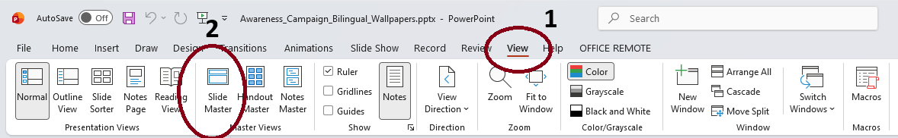
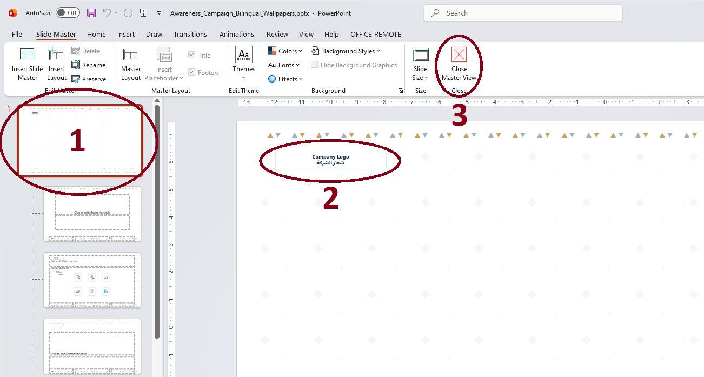
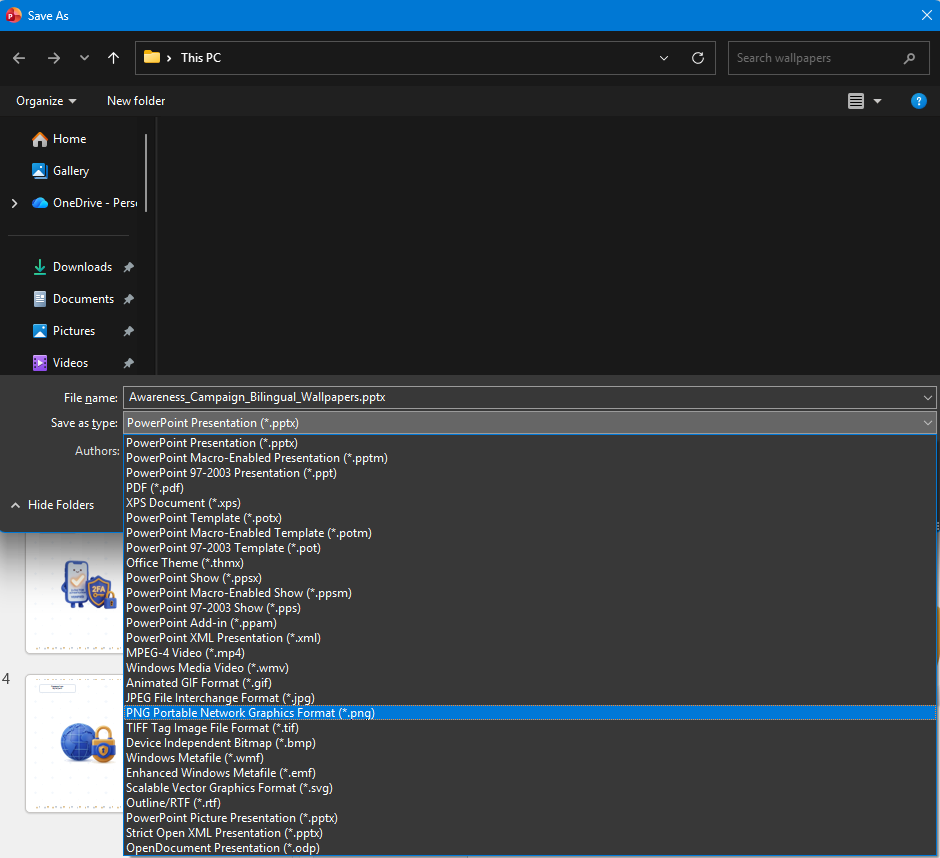
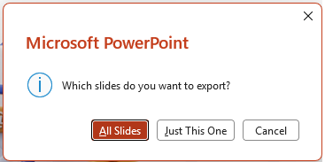

# 🛡️ حزمة خلفيات التوعية بالأمن السيبراني | Cybersecurity Awareness Wallpapers

حزمة خلفيات شاشات حاسوبية توعوية مفتوحة المصدر لشهر التوعية بالأمن السيبراني، مصممة وفق أرقى المعايير المؤسسية (ثنائية اللغة عربي / إنجليزي)، ومبنية بنظام القالب الموحد لتكون قابلة للتخصيص والاستخدام الفوري (Plug & Play) داخل أي مؤسسة.

---

## 📁 محتويات المجلد (Package Contents)
* 📄 **`Awareness_Campaign_Bilingual_Wallpapers.pptx`**: ملف العرض التقديمي المصدري عالي الدقة (1920x1080) متضمناً الخلفيات الأربعة لأسابيع الحملة.
* 🌐 **`guideAR.html`**: دليل الاستخدام التفاعلي المستقل باللغة العربية (يمكن فتحه في المتصفح مباشرة دون إنترنت).
* 🌐 **`GuideEN.html`**: The interactive standalone user guide in English (offline browser-ready).
* 📁 **`assets/`**: مجلد لقطات الشاشة التوضيحية لدليل الاستخدام (`01.png` إلى `04.png`).
* 📁 **`files/`**: مجلد الأرشيف متضمناً كافة السكربتات البرمجية، ملفات البيانات، ومخرجات التطوير.

---

## 🛠️ دليل التخصيص والاستخراج بالخطوات المصورة (Step-by-Step Guide)

تم بناء القالب ليعتمد كلياً على **الشريحة الرئيسية (Slide Master)**؛ مما يتيح لك استبدال أو حذف شعار الشركة، أو إزالة الفوتر **مرة واحدة فقط** لتنعكس التعديلات تلقائياً على كافة الخلفيات، ثم استخراجها كصور عالية الدقة.

---

### المرحلة الأولى: الدخول إلى الشريحة الرئيسية (Accessing Slide Master)

* **الخطوة (1):** من الشريط العلوي لبرنامج PowerPoint (الـ Ribbon)، اضغط على تبويب **View** (عرض).
* **الخطوة (2):** من قسم Master Views، اضغط على زر **Slide Master** (الشريحة الرئيسية).

---

### المرحلة الثانية: تخصيص الشعار والفوتر والخروج (Customizing Logo, Footer & Closing)

* **الخطوة (1) — اختيار الشريحة الأم الأولى:**
  في العمود الجانبي الأيسر، تأكد من التمرير للأعلى واختيار **الشريحة الرئيسية الأولى رقم (1)** (Master Slide).
  > **تنبيه:** اختيار الشريحة الأم رقم (1) يضمن تطبيق تعديلاتك على كافة شرائح العرض آلياً.

* **الخطوة (2) — استبدال أو حذف الشعار والفوتر:**
  * **شعار الشركة (Company Logo):** انقر على مستطيل الشعار أعلى اليسار:
    * **لحذفه:** اضغط على زر `Delete` من لوحة المفاتيح.
    * **لاستبداله بشعار شركتك:** احذف المربع، ثم من قائمة `Insert` (إدراج) اختر `Pictures` (صور) وأدرج شعار شركتك وضعه في نفس الموضع.
  * **الفوتر السفلي (Footer):** في نفس الشريحة بالأسفل جهة اليمين، يمكنك النقر على مربع الفوتر التوثيقي ومسحه بالكامل أو كتابة اسم إدارتك.

* **الخطوة (3) — إغلاق الشريحة الرئيسية وحفظ التعديلات:**
  * اضغط على زر **Close Master View** (إغلاق عرض الشريحة الرئيسية) باللون الأحمر في الشريط العلوي للعودة إلى وضع العمل العادي وملاحظة تطبيق التعديل على جميع الخلفيات فوراً.

---

### المرحلة الثالثة: تصدير الخلفيات كصور لشاشات الموظفين (Exporting Wallpapers as Images)

ابدأ هذه المرحلة بالضغط على مفتاح **F12** من لوحة المفاتيح داخل برنامج PowerPoint لفتح نافذة **حفظ باسم (Save As)** مباشرة:

* **الخطوة (03):** 
  من القائمة المنسدلة لنوع الملف (**Save as type**)، اختر صيغة:
  **`PNG Portable Network Graphics Format (*.png)`**
  ثم حدد المجلد واضغط زر **Save** (حفظ).

* **الخطوة (04):** 
  ستظهر لك نافذة منبثقة من PowerPoint تسألك عن الشرائح المطلوب تصديرها (*Which slides do you want to export?*)؛ اضغط على زر:
  **`All Slides`** (كافة الشرائح).
  
> 💡 **النتيجة:** سيقوم PowerPoint تلقائياً بإنشاء مجلد يحتوي على خلفيات الحملة كاملة بدقة فائقة 1080p جاهزة للنشر والتوزيع للموظفين كخلفيات شاشة (Wallpapers) أو شاشات توقف (Screensavers).

---

## 📜 الترخيص (License)
هذا المشروع مفتوح المصدر ومتاح مجاناً للمجتمع ولجميع المؤسسات تحت ترخيص:
**Creative Commons Attribution 4.0 International (CC BY 4.0)**.
